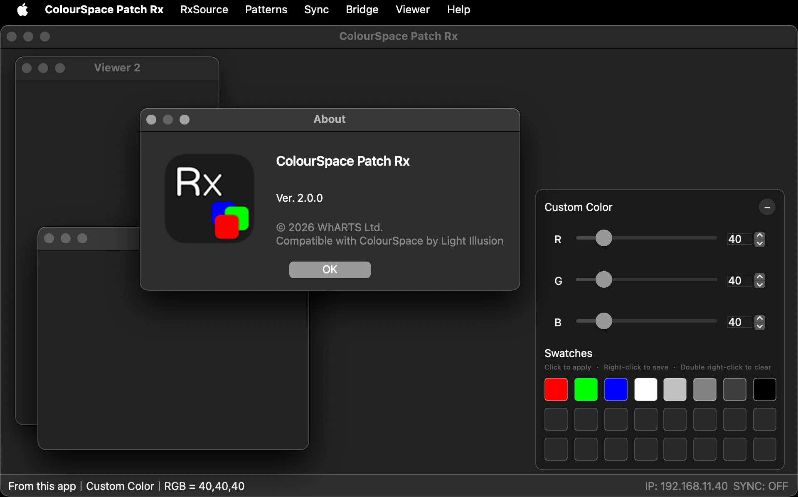

# ColourSpace Patch Rx

A network patch receiver for **Light Illusion ColourSpace** and **DisplayCAL**.

ColourSpace Patch Rx allows you to receive and display patch data over the network, enabling flexible multi-device workflows for calibration, testing, and verification.

---

## Preview

---

## Features

- Receive patch data from ColourSpace (Network Server)
- Support for DisplayCAL patch data (since v2.0.0)
- Multi-device sync (controller / follower mode)
- Built-in test patterns
- Web viewer (browser-based display)
- Multi-window viewer support

---

## Download

👉 [Download from Releases](https://github.com/yuchungchen1214/colourspace-patch-rx/releases)

### macOS
- Apple Silicon (M1 / M2 / M3): mac-arm.dmg  
- Intel: mac-intel.dmg  

### Windows
- exe

---

## Quick Start

1. Launch the application  
2. In ColourSpace, go to **Hardware Options → Network Server**  
3. Note the IP address and port  
4. Enter the same IP and port in Patch Rx  
5. Once connected, patch data will be displayed in real time  

---

## Notes

- First official GitHub release (v2.0.0)  
- Previous versions were distributed privately  

---

## License

Currently not specified.
